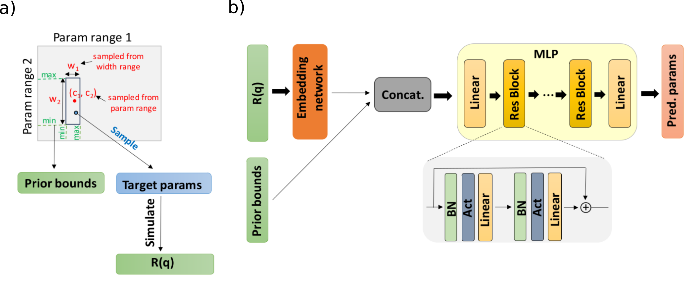

# Reflectorch

*Reflectorch* is a Pytorch-based package for the analysis of X-ray and neutron reflectivity data using neural networks developed by the [Schreiber Lab](https://www.soft-matter.uni-tuebingen.de/) located in Tübingen, Germany. 

Our training pipeline incorporates prior boundaries for the thin film parameters as an additional input to the neural network alongside the reflectivity curves. This allows the neural network to be trained simultaneously on the well-posed subintervals of a larger parameter space on which the inverse problem would otherwise be ill-posed / underdetermined (an issue primarily related to the phase problem). Consequently, our approach scales well for parameter spaces significantly larger that previously tackled other ML-based reflectomety solutions. From the perspective of the user, a neural network trained using this methodology allows the input of prior knowledge about the investigated thin film at inference time.



Please check out our arXiv article [Neural network analysis of neutron and X-ray reflectivity data](https://arxiv.org/abs/2307.05364) for in-depth information about the implementation of our method, the theory behind it and the performance evaluation. Additionally, our paper [Closing the loop: autonomous experiments enabled by machine-learning-based online data analysis in synchrotron beamline environments](https://journals.iucr.org/s/issues/2023/06/00/ju5054/index.html) published in the Journal of Synchrotron Radiation, uses the reflectorch package for the *in-situ* analysis of reflectivity data during a synchrotron experiment.


## Table of contents

Please check out the content pages to learn more about our package.

```{tableofcontents}
```
