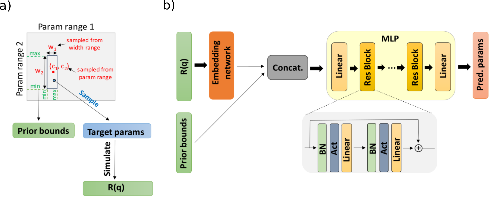

# Reflectorch

**Reflectorch** is a Python package for the analysis of X-ray and neutron reflectivity data using Pytorch-based neural networks developed by the [Schreiber Lab](https://www.soft-matter.uni-tuebingen.de/) located in Tübingen, Germany. 

Our training pipeline incorporates prior boundaries for the thin film parameters as an additional input to the neural network alongside the reflectivity curves. This allows the neural network to be trained simultaneously on the well-posed subintervals of a larger parameter space on which the inverse problem would otherwise be ill-posed / underdetermined (an issue primarily related to the phase problem). Consequently, our approach scales well for parameter spaces significantly larger that previously tackled by other ML-based reflectomety solutions. From the perspective of the user, a neural network trained using this methodology allows the input of prior knowledge about the investigated thin film at inference time.



## Citation

Please check out our article [Neural network analysis of neutron and X-ray reflectivity data incorporating prior knowledge](
https://doi.org/10.1107/S1600576724002115), published in the Journal of Applied Crystallography, for in-depth information about the implementation of our method, the theory behind it and the performance evaluation. Additionally, the article [Closing the loop: autonomous experiments enabled by machine-learning-based online data analysis in synchrotron beamline environments](https://journals.iucr.org/s/issues/2023/06/00/ju5054/index.html), published in the Journal of Synchrotron Radiation, uses the **reflectorch** package for the *in-situ* analysis of reflectivity data during a synchrotron experiment.

The research was part of a project (VIPR 05D23VT1 ERUMDATA) funded by the German Federal Ministry for Science and Education (BMBF). This work was partly supported by
the consortium DAPHNE4NFDI in the context of the work of the NFDI e.V., funded by the German Research Foundation.

```bibtex
@Article{Munteanu2024,
  author    = {Munteanu, Valentin and Starostin, Vladimir and Greco, Alessandro and Pithan, Linus and Gerlach, Alexander and Hinderhofer, Alexander and Kowarik, Stefan and Schreiber, Frank},
  journal   = {Journal of Applied Crystallography},
  title     = {Neural network analysis of neutron and X-ray reflectivity data incorporating prior knowledge},
  year      = {2024},
  issn      = {1600-5767},
  month     = mar,
  number    = {2},
  volume    = {57},
  doi       = {10.1107/s1600576724002115},
  publisher = {International Union of Crystallography (IUCr)},
}
```

## Table of contents

Please check out the content pages to learn more about our package.

```{tableofcontents}
```
